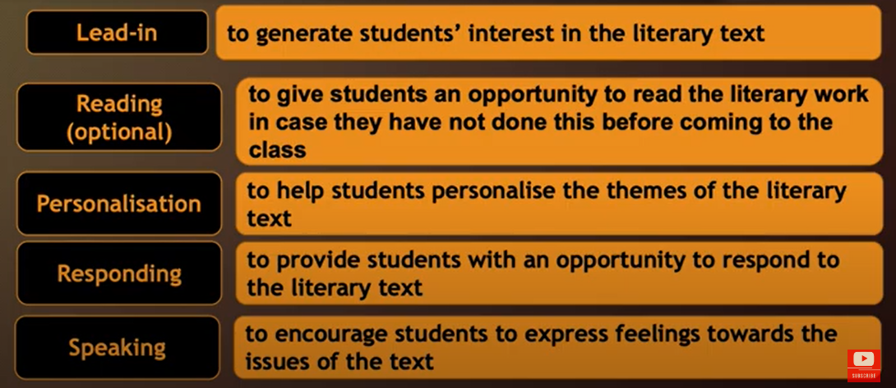

# Literature Lesson Builder

A Claude skill that turns any literary text (short story, poem, play extract, novel chapter) into a complete, student-centred lesson pack for high school English (grades 9-12), designed to keep Gen Z / Gen Alpha students engaged without lowering the learning value.

## What it produces
- Teacher lesson plan with timings, interaction patterns and answer keys
- PowerPoint (max 15 slides)
- Worksheet + extended worksheet, each differentiated on 3 levels (Support / Core / Challenge)
- Vocabulary taught in context through context clues + ECDW (Elicit, Concept-check, Drill, Write)
- Target reading skill: explained, modelled and drilled
- An interactive HTML game

## Lesson framework

Lead-in → Vocabulary → Reading (optional) → Summary & reading skill → Personalisation → Responding → Speaking → Exit ticket & game

## Install
Copy the `literature-lesson-builder` folder (containing `SKILL.md`) into your Claude skills directory, or upload it as a skill in Claude settings. Then just paste a literary text and ask for the lesson pack.

## Author
Sir Ammar - English teacher & SAT / ACT / IELTS trainer, Cairo
